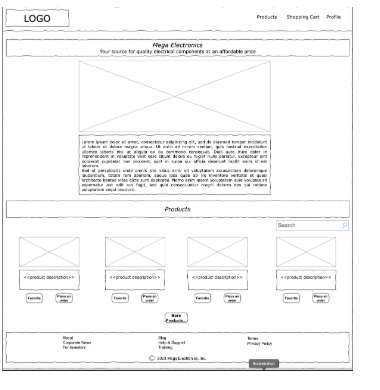

# roundtable-components

This application has been created as an example to be used to demonstrate
the techniques and considerations presented in the Chingu Roundtable - "All
About Components".

- [Process Overview](#process-overview)
- [Installation](#installation)
- [Usage](#usage)
- [Release History](#release-history)
- [License](#license)

## Process Overview



There's no real process flow for this app since its purpose is to aid in
demonstrating how to build components.

## Installation

To install this app:

```bash
git clone https://github.com/chingu-x/seshatbot.git
npm i
```

To run the app check out the information in the _'Usage'_ section below.

Seshatbot must be defined in the Discord server and granted administrator
permissions.

## Usage

This app can be started by issuing the following command in your terminal:

```bash
npm run dev

```

### Package.json Scripts

To support running in an unattended mode, such as a CRON task, there are two
distinct scripts that can be used for each metrics gathering function:

| Script name  | Purpose |
|--------------|---------|
| dev  | Start the application in development mode (e.g. local) |
| build | Build the production distribution |
| lint  | Run ESLINT |
| preview | Preview the production distribution |

### Special Considerations

None

## Release History

You can find what changed, when in the [release history](./docs/RELEASE_HISTORY.md)

## License

Copyright 2024 &copy; Chingu, Inc.

Redistribution and use in source and binary forms, with or without modification, are permitted provided that the following conditions are met:

1. Redistributions of source code must retain the above copyright notice, this list of conditions and the following disclaimer.

2. Redistributions in binary form must reproduce the above copyright notice, this list of conditions and the following disclaimer in the documentation and/or other materials provided with the distribution.

3. Neither the name of the copyright holder nor the names of its contributors may be used to endorse or promote products derived from this software without specific prior written permission.

THIS SOFTWARE IS PROVIDED BY THE COPYRIGHT HOLDERS AND CONTRIBUTORS "AS IS" AND ANY EXPRESS OR IMPLIED WARRANTIES, INCLUDING, BUT NOT LIMITED TO, THE IMPLIED WARRANTIES OF MERCHANTABILITY AND FITNESS FOR A PARTICULAR PURPOSE ARE DISCLAIMED. IN NO EVENT SHALL THE COPYRIGHT HOLDER OR CONTRIBUTORS BE LIABLE FOR ANY DIRECT, INDIRECT, INCIDENTAL, SPECIAL, EXEMPLARY, OR CONSEQUENTIAL DAMAGES (INCLUDING, BUT NOT LIMITED TO, PROCUREMENT OF SUBSTITUTE GOODS OR SERVICES; LOSS OF USE, DATA, OR PROFITS; OR BUSINESS INTERRUPTION) HOWEVER CAUSED AND ON ANY THEORY OF LIABILITY, WHETHER IN CONTRACT, STRICT LIABILITY, OR TORT (INCLUDING NEGLIGENCE OR OTHERWISE) ARISING IN ANY WAY OUT OF THE USE OF THIS SOFTWARE, EVEN IF ADVISED OF THE POSSIBILITY OF SUCH DAMAGE.
